Hi there 👋 — I'm a researcher at **Beijing Jiaotong University**, working on **deepfake detection**
and **traffic & air-transport simulation software**.

### 🔬 Research Directions

- **Cross-domain deepfake detection** — training-time interventions for face-forgery detection
  that generalize to unseen manipulation methods. Lightweight attention modules, weight
  averaging, and evaluation methodology: why the trajectory mean is more reliable than the best
  checkpoint, and what it takes to reproduce a negative result.
- **Traffic & air-transport simulation**

### 🛠 Projects

- [**spsa-deepfake-detection**](https://github.com/LuKun-Zhang/spsa-deepfake-detection) —
  reproduction package for *A Superadditive Weight-Averaging Strategy with Split-Pool
  Self-Attention for Deepfake Detection* (ICASSP 2027 submission): the code, configurations, and
  training logs behind every number reported in the paper.
- [AeroTower](https://github.com/LuKun-Zhang/AeroTower) — civil-aviation route-dispatch simulation application

### 📫 Get in Touch

- [github.com/LuKun-Zhang](https://github.com/LuKun-Zhang)
